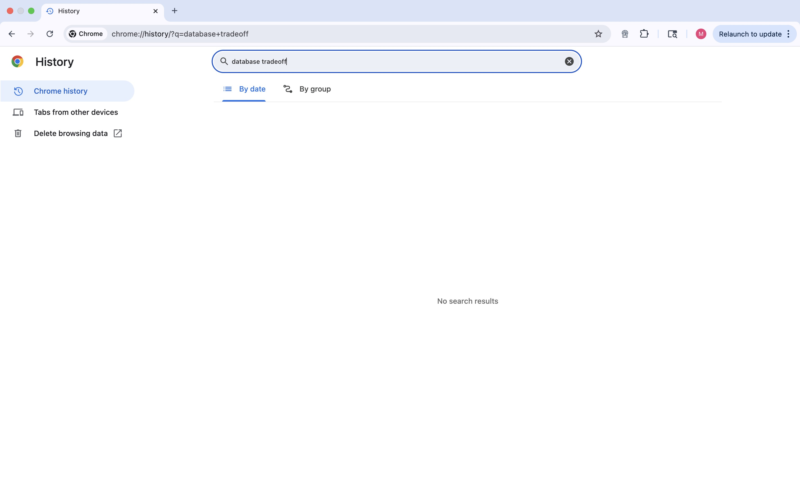
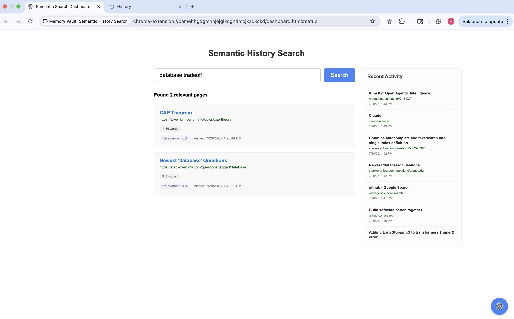

# 🧠 Memory Vault: AI-Powered Browser History

**Find any page you've read by meaning, not keywords. Transform your browsing history into an intelligent, searchable knowledge base.**

## 🎯 The Problem

You read an interesting article about databases weeks ago. Now in a meeting, you need that specific article but can't remember the title. Chrome history search fails because you can only search by keywords, not concepts.

## ✨ The Solution  

Memory Vault uses AI to understand what pages *mean*, not just what they say. Search for `"database tradeoffs"` and instantly find that article about CAP Theorem you read weeks ago.

## 🚀 Key Features

- **🧠 Semantic Search** - Find pages by concepts, not keywords  
- **🤖 Google Gemini AI** - State-of-the-art content understanding
- **🔒 Privacy-First** - All data stored locally in your browser
- **📱 Simple Setup** - Just add your free Google API key
- **⚡ Fast & Efficient** - Handles thousands of pages smoothly

## 🔄 How It Works

1. **Browse** - Extension captures page content automatically
2. **Process** - AI creates semantic understanding of each page  
3. **Store** - Everything saved locally (never leaves your browser)
4. **Search** - Find pages using natural language queries

---

## 📊 See The Difference

**Scenario:** You read about database trade-offs weeks ago. In a meeting, you need that article but can't remember the title.

### ❌ Chrome History Search
Search: `"database tradeoffs"`  

*Results: Hundreds of irrelevant pages, but not the one you need*

### ✅ Memory Vault Search  
Search: `"database tradeoffs"`  

*Result: Instantly finds the CAP Theorem article by understanding meaning*

**The difference?** Memory Vault understands concepts, not just keywords.

---

## 🚀 Quick Start

### 1. Install
- **Chrome Web Store:** Coming soon (under review)
- **Developer:** `git clone` → Load unpacked in `chrome://extensions`

### 2. Setup API Key  
- Get free API key: [Google AI Studio](https://aistudio.google.com/app/apikey)
- Click Memory Vault icon → "Get Started" → Paste key → Save

### 3. Use
- **Browse normally** - Extension captures pages automatically
- **Search by meaning** - Open dashboard and search concepts, not keywords
